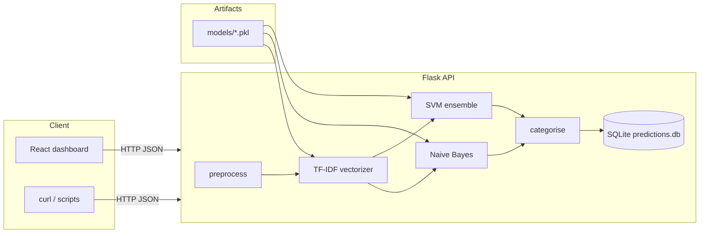

# System overview — Multi-Channel Spam Detector

This document explains **how the system works end-to-end**: architecture, data flow, API behavior, dashboard integration, and why each major dependency exists. It complements the setup steps in [README.md](README.md).

---

## High-level architecture

1. **Training** (`train.py`) builds the three pickle files from labeled data + `preprocess.py`.
2. **Serving** (`app.py`) loads pickles once at startup, runs the same preprocessing + models per request, then logs to SQLite.
3. **Dashboard** (`dashboard/`) is a static SPA that talks to the API over HTTP; it does not run ML locally.

---

## Data flow (training)

1. **Load raw datasets**
   - **SMS:** `data/SMSSpamCollection` (tab-separated: label, text). Labels `spam` / `ham` become binary targets.
   - **Email:** `data/email_spam_data.csv` with columns including `text`, `label`, `channel`.
   - **Social:** `data/social_spam_data.csv` (same idea).

2. **Concatenate** rows into one dataframe with columns `text`, `channel`, `label_bin`.

3. **Preprocess** each row: `preprocess(text, channel)` → string of lemmatized tokens (see below).

4. **Split** stratified train/test (80/20, fixed `random_state` for repeatability).

5. **Vectorize** with `TfidfVectorizer` (up to 5000 features, unigrams + bigrams), **fit on train only**.

6. **Train**
   - `MultinomialNB` on TF-IDF matrix.
   - `CalibratedClassifierCV(LinearSVC(...))` for **probability estimates** used in the API ensemble.

7. **Persist** `tfidf.pkl`, `nb.pkl`, `svm.pkl` under `models/`.

Synthetic email/social builders (`build_email_dataset.py`, `build_social_dataset.py`) exist so you can train without external email/social corpora; swap in real data when available.

---

## Data flow (prediction request)

When a client sends `POST /predict` with JSON `{"text": "...", "channel": "sms|email|social"}`:

1. **Validate** body; return `400` if `text` or `channel` is missing.

2. **Preprocess** — Same function as training: normalize URLs/phones, optional HTML strip for email, lowercase, remove noise, lemmatize, drop stopwords.

3. **Vectorize** — `tfidf.transform([clean])` (no refitting).

4. **Scores** — `predict_proba` for spam class from NB and SVM; **ensemble confidence** = `0.5 * nb + 0.5 * svm` (rounded).

5. **Label** — `SPAM` if confidence **> 0.3**, else `HAM`. (Threshold is a product choice, not learned.)

6. **Category** — `categorise(original_text, label)` runs **keyword rules** on the **original** text (not only the cleaned string) to pick a bucket such as “Phishing” or “General”.

7. **Log** — Insert row into `logs/predictions.db` (truncated text to 500 chars for storage).

8. **Respond** — JSON with `label`, `category`, `confidence`, `breakdown` (per-model scores), `latency_ms`.

Other read paths:

- **`GET /history`** — Last 50 rows for the dashboard history view.
- **`GET /stats`** — Aggregates for “today” (SQLite `date('now')`) plus top categories over all time.
- **`GET /health`** — Lightweight probe; dashboard polls this every 15 seconds (with timeout) to show online/offline state.

---

## How requests are handled (Flask)

| Concern | Behavior |
|---------|----------|
| **CORS** | `flask_cors.CORS(app)` allows browser calls from the Vite dev server (and other origins in dev). Tighten for production. |
| **OPTIONS** | `/predict` returns `200` for preflight. |
| **Errors** | Missing fields → `400` + `{"error": "..."}`. |
| **Concurrency** | Single-process Flask `app.run(debug=True)`. Fine for local dev; use a production WSGI server + pooling for real traffic. |
| **State** | Models loaded **once** at import time; SQLite opened per request (simple; acceptable at small scale). |

---

## Dashboard integration

- **`dashboard/src/lib/api.ts`** — Central place for `API_BASE` from `import.meta.env.VITE_API_BASE` or default `http://localhost:5000`. All fetches use this base.
- **`predict`**, **`fetchHistory`**, **`checkHealth`** map to `/predict`, `/history`, `/health`.
- **`useApiHealth`** — Polls `/health` to drive `ApiOfflineBanner` and UX when the API is down.
- **Routing** — `App.tsx`: `/` classifier, `/inbox`, `/history` inside `AppShell`.

The dashboard never reads `models/` or SQLite directly; the API is the single integration boundary.

---

## Offline evaluation (`evaluate.py`)

- Rebuilds a test split by **shuffling** the combined dataframe and taking the **last 20%** (not identical to `train_test_split` in `train.py`, but useful for a quick report).
- Reports metrics for NB, SVM, and a **manual ensemble** matching the API’s 0.5/0.5 average and **0.3** threshold.
- Prints **per-channel** accuracy for the SVM on the test slice.

Use this after retraining or changing data to compare models without starting the server.

---

## Dependencies and why they are used

| Package | Role in this project |
|---------|----------------------|
| **flask** | HTTP server and routing for `/predict`, `/history`, `/stats`, `/health`. |
| **flask-cors** | Allows browser clients (dashboard) to call the API cross-origin during development. |
| **scikit-learn** | TF-IDF, Naive Bayes, linear SVM, calibration, train/test split, metrics. |
| **pandas** | Loading CSV / TSV, merging channels, training pipeline. |
| **numpy** | Used by scikit-learn under the hood. |
| **nltk** | Stopword list, WordNet lemmatizer; `preprocess.py` downloads required NLTK data quietly on first use. |
| **joblib** | Save/load `tfidf`, `nb`, `svm` pickles. |
| **torch**, **transformers** (requirements only) | **Not referenced** by current Python source; likely reserved for future transformer models. Safe to omit for the default workflow. |

**Frontend (dashboard):**

| Package | Role |
|---------|------|
| **react**, **react-dom** | UI components and rendering. |
| **react-router-dom** | Pages: classifier, inbox, history. |
| **vite**, **@vitejs/plugin-react** | Dev server and production bundling. |
| **typescript** | Type-safe API client and components. |
| **tailwindcss**, **@tailwindcss/vite** | Styling. |
| **radix-ui** (various) | Accessible primitives (buttons, select, etc.). |
| **lucide-react** | Icons. |

---

## Important files and folders

Each entry: **name** → **purpose** → **what it does** → **how it interacts**.

### Repository root

| Name | Purpose | What it does | Interactions |
|------|---------|--------------|--------------|
| `app.py` | HTTP API | Loads pickles; serves predict/history/stats/health; writes SQLite. | Imports `preprocess`, `categorise`; reads `models/*`; read/write `logs/predictions.db`. |
| `train.py` | Training | Loads all channels, preprocesses, trains TF-IDF + NB + SVM, saves pickles. | Reads `data/*`; imports `preprocess`; writes `models/*`. |
| `preprocess.py` | NLP pipeline | Cleans and tokenizes text per channel. | Used by `train.py`, `app.py`, `evaluate.py`; downloads NLTK data. |
| `categorise.py` | Post-label tagging | Keyword rules → category string after SPAM/HAM. | Called from `app.py` only. |
| `evaluate.py` | Metrics | Offline NB / SVM / ensemble evaluation and per-channel stats. | Reads `data/*`, `models/*`; uses `preprocess`. |
| `build_email_dataset.py` | Data generation | Writes synthetic `data/email_spam_data.csv`. | Run before training if file missing. |
| `build_social_dataset.py` | Data generation | Writes synthetic `data/social_spam_data.csv`. | Run before training if file missing. |
| `requirements.txt` | Python deps | Declares packages for `pip install`. | Should match what `train.py` / `app.py` need. |
| `README.md` | User docs | Setup, run, ngrok, troubleshooting. | — |

### `data/`

| Name | Purpose | What it does | Interactions |
|------|---------|--------------|--------------|
| `SMSSpamCollection` | SMS corpus | UCI SMS Spam Collection (tab-separated). | Read by `train.py`, `evaluate.py`. |
| `email_spam_data.csv` | Email rows | Labeled `text` / `spam` / `ham` (+ `channel`). | Read by `train.py`, `evaluate.py`; created by builder script. |
| `social_spam_data.csv` | Social rows | Same pattern for social-style text. | Read by `train.py`, `evaluate.py`; created by builder script. |

### `models/`

| Name | Purpose | What it does | Interactions |
|------|---------|--------------|--------------|
| `tfidf.pkl` | Vectorizer | Turns preprocessed strings into sparse features. | Loaded by `app.py`, `evaluate.py`; written by `train.py`. |
| `nb.pkl` | Classifier | Multinomial Naive Bayes spam probabilities. | Same as above. |
| `svm.pkl` | Classifier | Calibrated LinearSVC spam probabilities. | Same as above. |

### `logs/`

| Name | Purpose | What it does | Interactions |
|------|---------|--------------|--------------|
| `predictions.db` | SQLite DB | Table `predictions` stores each API prediction. | Written by `POST /predict`; read by `/history`, `/stats`. Created on first API start. |

### `dashboard/`

| Name | Purpose | What it does | Interactions |
|------|---------|--------------|--------------|
| `package.json` | Node manifest | Scripts: `dev`, `build`, `lint`. | `npm install` / `npm run dev`. |
| `vite.config.ts` | Vite config | Dev server port 5173, React + Tailwind, `@/` alias. | Build and dev tooling. |
| `.env.example` | Env template | Documents `VITE_API_BASE`. | Copy to `.env` locally. |
| `src/lib/api.ts` | API client | `predict`, `fetchHistory`, `checkHealth`, `API_BASE`. | Used by pages and hooks. |
| `src/hooks/useApiHealth.ts` | Health polling | Periodic `/health` checks, 4s timeout. | Drives offline UI state. |
| `src/App.tsx` | Routes | `/`, `/inbox`, `/history`. | Wraps pages in `AppShell`. |
| `src/pages/*.tsx` | Screens | Classifier, inbox, history UIs. | Call `api.ts` endpoints. |
| `src/components/*` | UI | Layout, charts, banners, shared UI. | Composed by pages. |

---

## Design notes and extension points

- **Threshold 0.3** — Lower → more spam flagged; higher → fewer false positives. Should be tuned on a **validation set** that matches your deployment mix.
- **50/50 ensemble** — Weights could be learned or channel-specific (e.g. more weight to NB on short SMS).
- **Categories** — Purely rule-based; replace with a second model or LLM if you need finer granularity.
- **Data realism** — Synthetic email/social data is for **development only**; real spam evolves quickly.

This overview should give contributors enough context to change one layer (data, model, API, or UI) without guessing how the rest of the system behaves.
